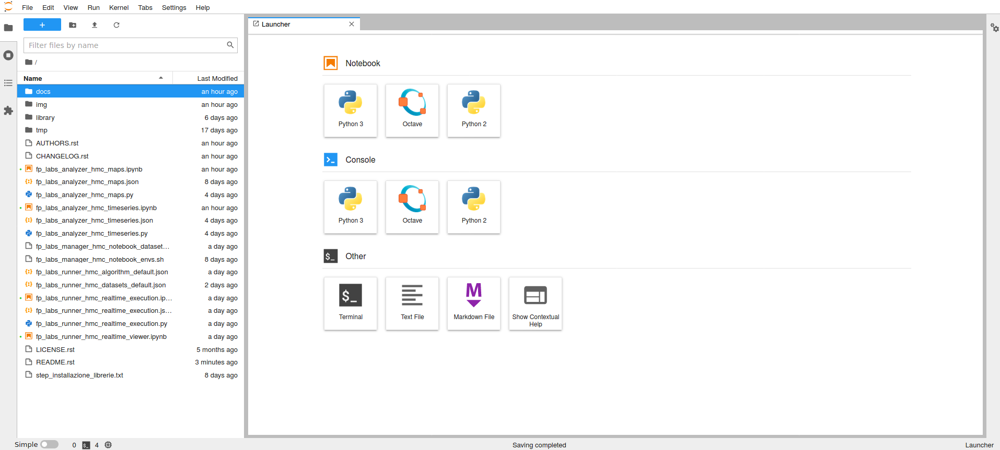
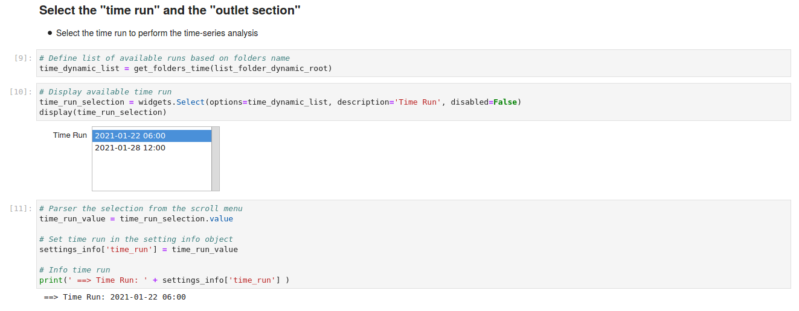
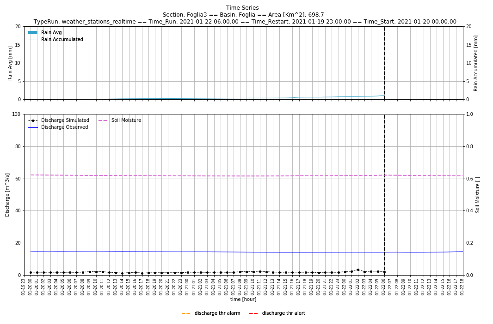
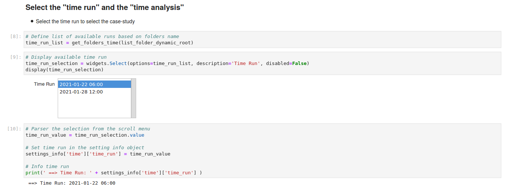
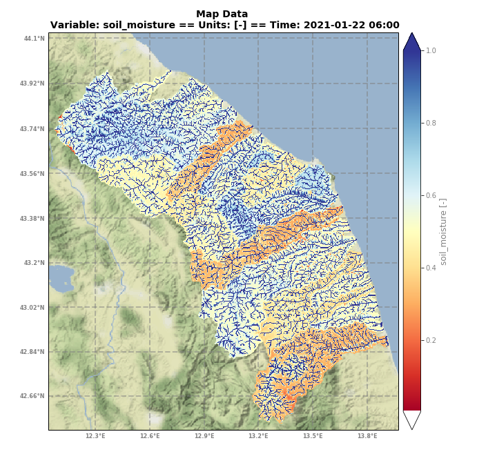
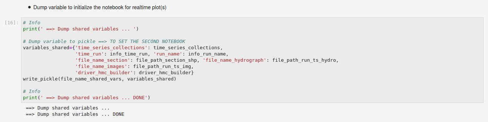
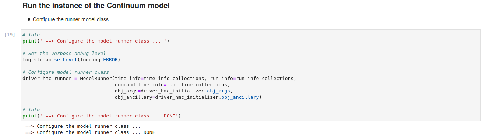
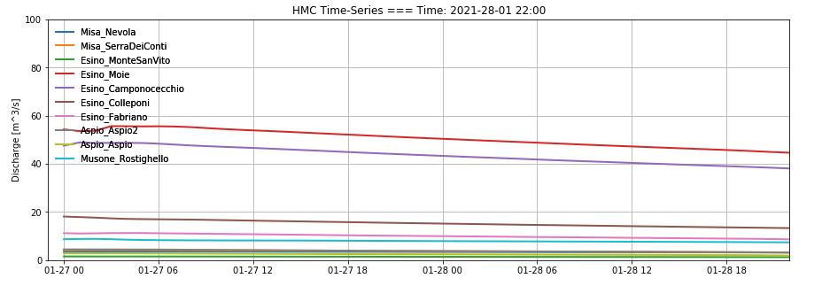

Flood PROOFS Labs
=================
Welcome to the **FloodPROOFS Modelling** GitHub repository. This is a Modelling System supported by the Italian 
Civil Department (DPC) and is used for preventing and reducing hydrogeological risk.

Background
**********

Flood-PROOFS 
------------
**Flood-PROOFS** (Flood PRObabilistic Operative Forecasting System) is a system designed by CIMA Research Foundation 
to support decision makers during the operational phases of flood forecasting and monitoring. The goal is to protect 
the population and infrastructure from damage caused by intense precipitation events.

The Flood-PROOFS system manages the data flow deriving from various modelling tools developed by the CIMA Research 
Foundation to return a quantitative assessment of the effects that precipitation can have on the territory in terms of 
flow and probability to overcome the critical thresholds in the different basins. 

The system has been operating since 2008 at various Functional Centers (Autonomous Region of Valle d'Aosta and Marche) 
where it is used for the issue of hydro-meteorological warnings for civil protection purposes. At the technical offices of 
tùhe Valle d'Aosta Water Company (CVA) it is instead useful to study and implement strategies to mitigate flood events or 
to secure facilities in the event of flooding.

Jupyter Notebook and Labs
-------------------------
JupyterLab is a web-based interactive development environment for Jupyter_ notebooks, code, and data. JupyterLab is flexible: 
configure and arrange the user interface to support a wide range of workflows in data science, scientific computing, and machine 
learning. JupyterLab is extensible and modular: write plugins that add new components and integrate with existing ones.

Jupyter Notebooks are a spin-off project from the IPython project, which used to have an IPython Notebook project itself. 
The name, Jupyter, comes from the core supported programming languages that it supports: Julia, Python, and R. Jupyter ships 
with the IPython kernel, which allows you to write your programs in Python, but there are currently over 100 other kernels 
that you can also use.

The Jupyter notebooks of Flood-PROOFS modelling system, are developt to aim the following main goals:
1) run the Continuum model in a basic configuration (based on the ground network measurements only);
2) analyze the results of the Continuum model in time-series and maps format.

.. _Jupyter: https://jupyter.org/

Prerequisites
*************
In order to use the Flood-PROOFS labs, users are strongly raccomanted to control if the following characteristics, libraries and packages are available and correctly installed on their machine.

Usually, Flood-PROOFS libraries are installed on **Linux Debian/Ubuntu 64bit** environment and all libraries, packages and applications must be compilled and/or installed in according with this operative system.

All codes, subroutines and scripts are developed using both **Python** (version 3 and greater) [2_] and **Fortran** (version 2003 and greater) [3_]. QGIS geographic information system (version 2.18 and greater) [4_] is used to develop tools to organize, create and control static and dynamic datasets. R (version 3.4.4 and greater) [5_] is used to perform statistical analysis.

The libraries and the packages are mainly divided in three categories:

    • python3 packages and applications;
    • fortran libraries;
    • other software and applications (Jupyter Notebook, QGIS, Panoply, cdo, ncview ...).

The section for installing all needed libraries and environments is usually named **fp-envs** and the users can find it in Flood-PROOFS
modelling system repository hosted by GitHub [1_].

Python3 libraries
-----------------
The python3 standard library is not sufficient to correctly install all Flood-PROOFS labs; for this reason some extra libraries are needed to guarantee all functionalities. 
To install all python3 libraries a bash script named **setup_fp_env_python_hmc.sh** is provided [6_]; basically, the script calls a **miniconda** [7_] installation that allow to get all needed libraries and install them into “$HOME/fp_libs_python/” folder. During the installation, a virtual environment named “fp_virtualenv_python3_hmc” are created too.
Once all libraries are correctly installed and configurated, to activate "fp_virtualenv_python3_hmc” by command-line is necessary to execute the following:

.. code-block:: bash

    >> fp_virtualenv_folder=$HOME'/fp_virtualenv_python3_hmc/'
    >> fp_virtualenv_libs='fp_virtualenv_python3_hmc_libraries'
    
    >> export PATH=$fp_virtualenv_folder/bin:$PATH
    >> source activate $fp_virtualenv_libs

By default, the **fp_virtualenv_python3_hmc** environment is shown in parentheses () or brackets [] at the beginning of your command prompt:

.. code-block:: bash

   (fp_virtualenv_python3_hmc) >> 

Activating the virtual enviroment permits to use a correct configuration andall applications and scripts of Flood-PROOFS forecasting chain will work properly.

Fortran libraries
-----------------
Hydrological model Continuum needs netcdf4 library to read input provided by other preprocessing tools and to write output for external applications (such as Panoply, cdo, ncview ...).
To set and compile netcdf4 library a bash script named **setup_fp_env_system.sh** is provided. 
Script downloads **zlib** [8_], **hdf5** [9_] and **netcdf4** [10_] libraries from their repositories; after downloading source compressed archives, script creates a folder in “$HOME/fp_libs_system/” where all libraries will be compilled and installed. During the installation, a environment file named “fp_env_system” is created for saving LD_LIBRARY_PATH (for native code libraries) and PATH (for executables) references of installed libraries.

HMC libraries
-------------
After preparing all necessary libraries and environmental settings, source files of HMC must be compiled to run properly [11_]; usually, sources are compiled using **GNU compilers** (such as gcc and gfortran) that have to be installed on user’s machine. To compile and optimize HMC codes a bash file named **setup_fp_env_hmc.sh** is provided. Using this setup file, user will have to answer some questions about how to compile HMC codes.
Usually, to build Continuum for production use, the users have to use the bash script named **setup_fp_env_hmc.sh**  
and set the options as follows:

    • set compiler type [1] for using GNU/GFortran compiler;
    • set optimization option [2] for using production mode; 
    • set profiler option [2] for skipping profiling used to control model performances;
    • set NetCDF4 library [1] for using NetCDF4 input and output files format.

Jupyter Notebooks for Continuum model
*************************************
The complete environment of the jupyter notebook of Continuum model will be saved in the $HOME
directory of the machine; obviously, the users can modify this option but they have to update
the paths of the scripts according with their choice.

The standard configuration will be as shown.

::

    .
    ├── .bash_logout
    ├── .bashrc
    ├── .conda
    ├── .netrc
    ├── .ssh
    ├── fp_labs_datasets
    ├── fp_labs_hmc
    ├── fp_libs_system
    ├── fp_run_hmc
    ├── fp_virtualenv_python3_hat
    ├── fp_virtualenv_python3_hmc
    └── fp_virtualenv_python3_hyde

In the .netrc file, the users have to save the information to authenticate their machine in the
remote server (if they have to download the datasets from remote server to local machine).

The fp-labs procedures will read from the .netrc file the following information:

.. code-block:: bash
    
    machine machine_name login myuser password mypassword

The users have to set them according with their account.

Download the jupyter-lab sources 
--------------------------------
The users, in the $HOME machine folder, on the command-line have to run the following:

.. code-block:: bash

    >> git clone https://github.com/c-hydro/fp-labs-hmc.git --branch v1.0.0 --single-branch fp_labs_hmc
    

At the end the "/$HOME/fp_labs_hmc/" will be created.
The users have to enter in the "/$HOME/fp-labs-hmc/" where they found all the scripts needed by
the labs to run properly.

The structure of the "/$HOME/fp_labs_hmc/" is reported:

::

    .
    ├── AUTHORS.rst
    ├── CHANGELOG.rst
    ├── docs
    ├── fp_labs_analyzer_hmc_maps.ipynb
    ├── fp_labs_analyzer_hmc_maps.json
    ├── fp_labs_analyzer_hmc_maps.py
    ├── fp_labs_analyzer_hmc_timeseries.ipynb
    ├── fp_labs_analyzer_hmc_timeseries.json
    ├── fp_labs_analyzer_hmc_timeseries.py
    ├── fp_labs_manager_hmc_notebook_datasets.sh
    ├── fp_labs_manager_hmc_notebook_envs.sh
    ├── fp_labs_runner_hmc_algorithm_default.json
    ├── fp_labs_runner_hmc_datasets_default.json
    ├── fp_labs_runner_hmc_realtime_execution.ipynb
    ├── fp_labs_runner_hmc_realtime_execution.json
    ├── fp_labs_runner_hmc_realtime_execution.py
    ├── fp_labs_runner_hmc_realtime_viewer.ipynb
    ├── img
    ├── library
    │   ├── jupyter_generic
    │   └── jupyter_hmc
    ├── LICENSE.rst
    ├── README.rst
    └── tmp

Organize the jupyter-lab datasets
---------------------------------
To organize the labs, the users have to organize/copy all the datasets in the right place of their machines.
Particularly, the script "fp_labs_manager_hmc_notebook_datasets.sh" to perform this task is provided;
the users have to edit the "time_run" information according with the case study that they should analyze.
For example:

.. code-block:: bash

    time_run="YYYY-mm-dd HH:00"
    
For example, the users can set the time information as follows:

.. code-block:: bash

    time_run="2021-01-22 06:00"

After editing and saving the script, the users should run the script:

.. code-block:: bash

    >> ./fp_labs_manager_hmc_notebook_datasets.sh

The procedure could take several minutes.
The script will create the folders structure related to the "time_run" information:

::

    .
    ├── data_dynamic
    │   ├── 20210122_06
    │   │   ├── data_archive
    │   │   ├── data_forcing
    │   │   └── data_restart
    │   └── 20210128_12
    │       ├── data_archive
    │       ├── data_forcing
    │       └── data_restart
    ├── data_run
    ├── data_static
    │   ├── ancillary
    │   ├── colormap
    │   ├── expert_forecast
    │   ├── gridded
    │   ├── point
    │   └── shapefile
    └── images

Run the jupyter-lab environment
-------------------------------
The second step is related to the run of the jupyter-lab of hmc notebooks;
the users have to run the script "fp_labs_manager_hmc_notebook_envs.sh" in the folder "/$HOME/fp_labs_hmc/":

.. code-block:: bash
    
    >> ./fp_labs_manager_hmc_notebook_envs.sh
    
The procedure will install all the libraries and the extentions needed by the laboratories to work fine;
in addition, the hmc python3 package for configuring the Continuum model is set in the root of the libraries.
Particularly, the hmc package is downloaded and installed in the following mode:

.. code-block:: bash

    >> script_folder_labs_library_hmc=$HOME'/fp_labs_hmc/library/jupyter_hmc/'
    >> git clone https://github.com/c-hydro/hmc.git --branch v3.1.3 --single-branch $script_folder_labs_library_hmc"
    
If, all the steps ended correctly, the script will run the jupyter-lab and the instance will be open automatically:

.. code-block:: bash

    >> jupyter-lab

At this point, the users will able to run the Jupyter Notebooks or, alternatively, to create a new notebook for
analyzing the Continuum results.

FP-Labs: Analyzer HMC Timeseries
--------------------------------
The fp-labs of Continuum time-series is composed by the following script(s) and configuration file(s):

    - Jupyter Notebook main: **fp_labs_analyzer_hmc_timeseries.ipynb**
    - Jupyter Notebook configuration file: **fp_labs_analyzer_hmc_timeseries.json**

To run properly the notebook, the users have to update in the configuration file:

    a) the **"time_run"** field according with the date of the case-study previously organized;
    b) the **"domain_name"**, **"section_name"** and **"basin_name"** fields according with the shapefile of the sections.

For example:
   
.. code-block:: json

    "info": {
    "domain_name": "marche",
    "section_name": "tronto",
    "basin_name": "tronto"
    },
    "time_run" : "2021-01-22 06:00",

Alternatively, the users can edit the information using the scroll menus embedded in 
the notebook; the list of the dates will be in according with the datasets previously organized.

At this point, the users will be able to run and test each cell of the notebook.
Obviously, the users can be update/modify and test different graphs and analysis for checking
and controlling the results related to the forcing and outcome time-series information.

FP-Labs: Analyzer HMC Maps
--------------------------
The fp-labs of Continuum maps is composed by the following script(s) and configuration file(s):

    - Jupyter Notebook main: fp_labs_analyzer_hmc_maps.ipynb
    - Jupyter Notebook configuration file: fp_labs_analyzer_hmc_maps.json

To run properly the notebook, the users have to update in the configuration file:

    a) the **"time_run"** field according with the date of the case-study previously organized;
    b) the **"time_observed_period"** and **"time_observed_frequency"** fields according with the downloaded datasets;
    c) the **"time_analysis"** field to select a step to perform the analysis according with the previously steps;
    d) the **"domain_name"** field according with the shapefile of the sections;
    e) the **"var_list_forcing_obs_ws"** and **"var_list_outcome"** fields according with the structure of the forcing and the outcome netcdf files.

For example:
   
.. code-block:: json

    "info": {
        "domain_name": "marche",
        "var_list_forcing_obs_ws": ["Rain", "Air_Temperature", "Relative_Humidity"],
        "var_list_outcome": ["SM", "LST"]
    },
    "time" : {
        "time_run": "2021-01-22 06:00",
        "time_observed_period": 5,
        "time_observed_frequency": "H",
        "time_analysis": "2021-01-21 15:00"
    }

Alternatively, the users can edit the time information using the scroll menus embedded in 
the notebook; the list of the dates will be in according with the datasets previously organized.

At this point, the users will be able to run and test each cell of the notebook.
Obviously, the users can be update/modify and test different graphs and analysis for checking
and controlling the results related to the forcing and outcome gridded information.

FP-Labs: Runner HMC Execution and Viewer
----------------------------------------
The fp-labs of Continuum execution is composed by the following script(s) and configuration file(s):

    - Jupyter Notebook Runner Execution: fp_labs_runner_hmc_realtime_execution.ipynb
    - Jupyter Notebook Runner Viewer: fp_labs_runner_hmc_realtime_viewer.ipynb
    - Jupyter Notebook configuration file: fp_labs_runner_hmc_realtime_execution.json

The main goal of the notebook is the realtime analysis of the Continuum execution; in addition,
to run properly the notebook, the users have to update in the configuration file:

    a) the **"time_run"** field according with the date of the case-study previously organized;
    b) the **"domain_name"** field according with the shapefile of the sections;
    c) the **"run_name"** field according with the type of the run.

For example:
   
.. code-block:: json

    "info": {
        "run_name": "jupyter_ws",
        "domain_name": "marche",
        "time_run": "2021-01-22 06:00"
    }

Alternatively, the users can edit the time information using the scroll menu embedded in 
the notebook; the list of the dates will be in according with the datasets previously organized.

The notebook is organized in four main section:

    - initialize the instance of the model;
    - build the instance of the model;
    - run the instance of the model;
    - finalize the instance of the model.

In the initializer class sets the run and the datasets locations, the run features and the time information. All
the information of the run will save in the folder: $HOME/fp_run_hmc/
Particularly, the structure of the model folders will be as follows. 

::

    .
    └── jupyter_ws
        ├── **exec**
        │   ├── HMC_Model_V3_jupyter_ws.x
        │   └── marche.info.txt
        ├── **forcing**
        │   ├── gridded
        │   └── point
        ├── log
        └── **restart**
            ├── hmc.state-grid.202101262300.nc.gz
            └── hmc.state-point.202101262300.txt

During the building part, the static datasets, the dynamic restart datasets and the dynamic forcing 
datasets are checked and organized to fit the run structure and the model settings. 
The running part manages the execution of the model and gives some information of the run failures 
(if they happen) and states. After the running part, the structure of the folders will be organized
as shows.

::

    .
    └── jupyter_ws
        ├── **ancillary**
        │   ├── hmc.dynamic_outcome.202101281200.workspace
        │   ├── hmc.dynamic_source.202101281200.workspace
        │   ├── hmc.execution.202101281200.workspace
        │   └── hmc.static.workspace
        ├── exec
        │   ├── HMC_Model_V3_jupyter_ws.x
        │   └── marche.info.txt
        ├── forcing
        │   ├── gridded
        │   └── point
        ├── log
        │   └── hmc_jupyter_ws_log.txt
        ├── **outcome**
        │   ├── gridded
        │   ├── images
        │   ├── point
        │   └── timeseries
        ├── restart
        │   ├── hmc.state-grid.202101262300.nc.gz
        │   └── hmc.state-point.202101262300.txt
        └── **state**
            ├── gridded
            └── point

In the finalization part, the results are organized and merged with the observations (if they are available). In the
actual configuration of the notebook the results will be stored in the **fp_labs_datasets** folder. 

::

    .
    ├── data_dynamic
    │   ├── 20210122_06
    │   │   ├── data_archive
    │   │   ├── data_forcing
    │   │   └── data_restart
    │   └── 20210128_12
    │       ├── data_archive
    │       ├── data_forcing
    │       └── data_restart
    ├── **data_run**
    │   └── 20210128_12
    │       └── data_archive
    ├── data_static
    └── images

Before the running part, the users will able to save a group of variables using a pickle file;
this pickle file will be used by the notebook "fp_labs_runner_hmc_realtime_viewer.ipynb" that the users
will execute to activate the realtime analysis of the discharges time-series for a list of outlet sections.

To set-up this configuration, the users have to follow this steps:

    1) run the execution jupyter notebook until the dump section:

        .. code-block:: python

            # Info
            print(' ==> Dump shared variables ... ')

            # Dump variable to pickle ==> TO SET THE SECOND NOTEBOOK
            variables_shared={'time_series_collections': time_series_collections, 
                            'time_run': info_time_run, 'run_name': info_run_name,
                            'file_name_section': file_path_section_shp, 'file_name_hydrograph': file_path_run_ts_hydro,
                            'file_name_images': file_path_run_ts_img,
                            'driver_hmc_builder': driver_hmc_builder}
            write_pickle(file_name_shared_vars, variables_shared)

            # Info
            print(' ==> Dump shared variables ... DONE')

    2) run the viewer jupyter notebook until the plot section.
    3) run the execution jupyter notebook to the point where the Continuum model will start.

        .. code-block:: python

            # Info
            print(' ==> Execute the model run ... ')

            # Set the verbose debug level
            log_stream.setLevel(logging.INFO)

            # Configure the model execution
            driver_hmc_runner.configure_execution(ancillary_datasets_collections)

            # Info
            print(' ==> Execute the model run ... DONE')

    4) run the viewer jupyter notebook plot section.

The realtime analysis of the time-series will show in the last part of the viewer jupyter 
notebook. An exemple is reported in the next figure. The notebook will save all the images shown
during the execution of the model. The images are saved in the f

At this point, the users will be able to run the Continuum model using the predefined settings for 
the run based on the ground network observed measurements. 
Obviusly, the model uses a lot of parameters and they should be calibrated; in this example, a basic 
configuration will be use and, for this reason, it is possible that the simulations will be influenced 
by the lack of information. 

Potential Users
***************
The Flood-PROOFS Modelling System has been released to enable different applications (for example local/regional scenario assessment) and further development by external users.

Potential users are anticipated to predominately be interested in the ability to run the system with local data (including scenario modelling) and to modify the system with new capabilities. The potential collaborators have expressed a range of potential goals for their use of the modelling system, including performing comparisons with existing models, tailoring the hydrological performance to specific land uses and cropping types.

Broadly speaking, there are four potential user categories of the FloodPROOFS modelling system:

    • **Data user**: who accessing the model outputs for using them in their analysis.
    • **Case study user**: who work to evaluate his/her case using data over a selected time period.
    • **Applying users**: who would primarily be interested in applying the current model to a region of interest using localised and/or scenario data where available.
    • **Contributor users**: who will extend the capabilities of the model with new research and coding (modify the system with new capabilities)

It is expected that the majority of early adopters of the FloodPROOFS modelling system will be Applying users looking to apply the system with local data/scenarios, with more Contributor users adopting the system as it becomes well known and established.

Contribute and Guidelines
*************************

We are happy if you want to contribute. Please raise an issue explaining what is missing or if you find a bug. We will also gladly accept pull requests against our master branch for new features or bug fixes.

If you want to contribute please follow these steps:

    • fork the one of the Flood-PROOFS repositories to your account;
    • clone the repository, make sure you use "git clone --recursive" to also get the test data repository;
    • make a new feature branch from the repository master branch;
    • add your feature;
    • please include tests for your contributions in one of the test directories;
    • submit a pull request to our master branch.

Authors
*******

All authors involved in the library development for Flood-PROOFS modelling system are reported in this authors_ file.

License
*******

By accessing or using the Flood-PROOFS modelling system, code, data or documentation, you agree to be bound by the Flood-PROOFS license available. See the license_ for details. 

Changelog
*********

All notable changes and bugs fixing to this project will be documented in this changelog_ file.

References
**********
| [1_] c-hydro - Flood-PROOFS labs github repository 
| [2_] c-hydro - github repository
| [3_] c-hydro - Continuum github repository
| [4_] c-hydro - Flood-PROOFS venv tools github repository
| [5_] Python programming language
| [6_] Miniconda framework
| [7_] Jupyter Notebook and Jupyter Lab

.. _1: https://github.com/c-hydro/fp-labs-hmc
.. _2: https://github.com/c-hydro
.. _3: https://github.com/c-hydro/hmc
.. _4: https://github.com/c-hydro/fp-envs
.. _5: https://www.python.org/
.. _6: https://conda.io/miniconda.html
.. _7: https://jupyter.org/

.. _license: LICENSE.rst
.. _changelog: CHANGELOG.rst
.. _authors: AUTHORS.rst
